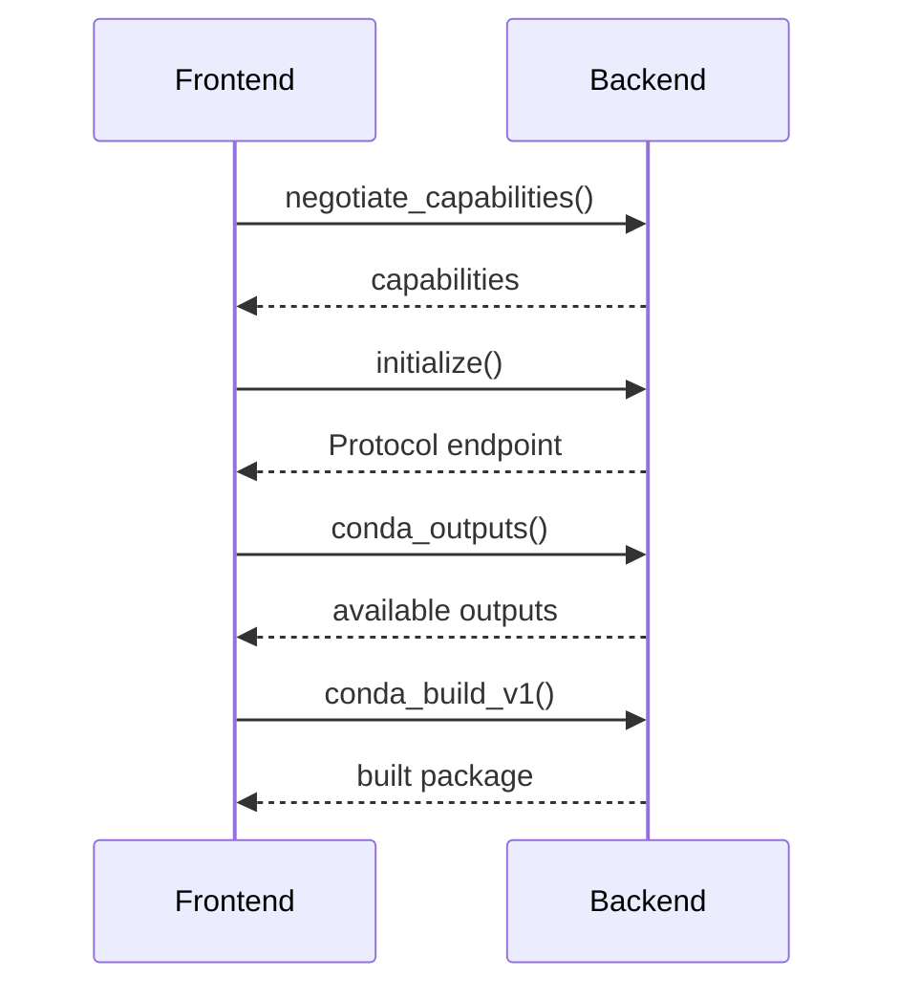

The protocol module defines the communication interface between Pixi frontends and build backends using JSON-RPC. It consists of two main traits: `ProtocolInstantiator` for setup and `Protocol` for handling build requests.

## ProtocolInstantiator Trait

Defined in: `src/protocol.rs:11`

The `ProtocolInstantiator` trait is responsible for creating protocol connections and endpoints that handle RPC calls.

```rust
#[async_trait::async_trait]
pub trait ProtocolInstantiator: Send + Sync + 'static {
    async fn negotiate_capabilities(
        params: NegotiateCapabilitiesParams,
    ) -> miette::Result<NegotiateCapabilitiesResult>;
    
    async fn initialize(
        &self,
        params: InitializeParams,
    ) -> miette::Result<(Box<dyn Protocol + Send + Sync + 'static>, InitializeResult)>;
}
```

### Methods

#### `negotiate_capabilities()`

```rust
async fn negotiate_capabilities(
    params: NegotiateCapabilitiesParams,
) -> miette::Result<NegotiateCapabilitiesResult>
```

Called when negotiating capabilities with the client. This determines how the rest of the initialization will proceed.

<ParamField path="params" type="NegotiateCapabilitiesParams">
  Contains the client's supported capabilities and protocol version
</ParamField>

<ResponseField name="return" type="miette::Result<NegotiateCapabilitiesResult>">
  Returns the backend's capabilities, including:
  - `provides_conda_outputs` - Whether the backend supports the conda/outputs method
  - `provides_conda_build_v1` - Whether the backend supports the conda/build_v1 method
</ResponseField>

---

#### `initialize()`

```rust
async fn initialize(
    &self,
    params: InitializeParams,
) -> miette::Result<(Box<dyn Protocol + Send + Sync + 'static>, InitializeResult)>
```

Called when the client requests initialization. Returns both the protocol endpoint and the initialization result.

<ParamField path="params" type="InitializeParams">
  Initialization parameters including:
  - `manifest_path` - Path to the project manifest
  - `source_directory` - Optional source directory override
  - `project_model` - The project model data
  - `configuration` - Backend-specific configuration
  - `target_configuration` - Per-target configuration overrides
  - `cache_directory` - Optional cache directory for build artifacts
</ParamField>

<ResponseField name="return" type="(Box<dyn Protocol>, InitializeResult)">
  A tuple containing:
  1. A boxed `Protocol` implementation that will handle subsequent RPC calls
  2. An `InitializeResult` (currently empty but reserved for future use)
</ResponseField>

---

## Protocol Trait

Defined in: `src/protocol.rs:30`

The `Protocol` trait defines the RPC methods that backends implement to handle build requests.

```rust
#[async_trait::async_trait]
pub trait Protocol {
    async fn conda_outputs(
        &self,
        params: CondaOutputsParams,
    ) -> miette::Result<CondaOutputsResult>;
    
    async fn conda_build_v1(
        &self,
        params: CondaBuildV1Params,
    ) -> miette::Result<CondaBuildV1Result>;
}
```

### Methods

#### `conda_outputs()`

```rust
async fn conda_outputs(
    &self,
    params: CondaOutputsParams,
) -> miette::Result<CondaOutputsResult>
```

Called when the client requests information about package outputs. This method generates a conda recipe and discovers all possible output variants without actually building them.

<ParamField path="params" type="CondaOutputsParams">
  Parameters for discovering outputs:
  - `host_platform` - The target platform for the build
  - `variant_configuration` - User-supplied variant values
  - `variant_files` - Paths to variant configuration files
  - `channels` - Conda channels to use for dependency resolution
  - `work_directory` - Directory for intermediate build files
</ParamField>

<ResponseField name="return" type="miette::Result<CondaOutputsResult>">
  Returns:
  - `outputs` - Array of `CondaOutput` objects, each describing a possible package variant with its metadata, dependencies, and build configuration
  - `input_globs` - File globs that should trigger a rebuild when changed
</ResponseField>

**Default Implementation**: Returns `unimplemented!("conda_outputs not implemented")`

<Expandable title="Example CondaOutput Structure">
```rust
CondaOutput {
    metadata: CondaOutputMetadata {
        name: PackageName,
        version: Version,
        build: String,  // build string
        build_number: u64,
        subdir: Platform,
        license: Option<String>,
        variant: BTreeMap<String, VariantValue>,
        // ...
    },
    build_dependencies: CondaOutputDependencies,
    host_dependencies: CondaOutputDependencies,
    run_dependencies: CondaOutputDependencies,
    run_exports: CondaOutputRunExports,
    ignore_run_exports: CondaOutputIgnoreRunExports,
}
```
</Expandable>

---

#### `conda_build_v1()`

```rust
async fn conda_build_v1(
    &self,
    params: CondaBuildV1Params,
) -> miette::Result<CondaBuildV1Result>
```

Called when the client requests to build a specific package output. This method performs the actual build and produces a conda package file.

<ParamField path="params" type="CondaBuildV1Params">
  Build parameters including:
  - `output` - Specification of which output to build (name, version, variant)
  - `host_prefix` - Path and platform of the host environment
  - `build_prefix` - Path and platform of the build environment
  - `work_directory` - Directory for build work files
  - `output_directory` - Where to place the built package
  - `channels` - Conda channels for dependency resolution
  - `editable` - Whether to create an editable install
  - `run_dependencies` - Finalized runtime dependencies
  - `run_constraints` - Runtime constraints
  - `run_exports` - Run exports from dependencies
</ParamField>

<ResponseField name="return" type="miette::Result<CondaBuildV1Result>">
  Returns:
  - `output_file` - Path to the built conda package (.conda or .tar.bz2)
  - `input_globs` - File patterns that affect the build
  - `name` - Package name
  - `version` - Package version
  - `build` - Build string
  - `subdir` - Platform subdirectory
</ResponseField>

**Default Implementation**: Returns `unimplemented!("conda_build_v1 not implemented")`

---

## Protocol Flow

The typical protocol interaction sequence is:



1. **Capability Negotiation** - Frontend and backend agree on supported features
2. **Initialization** - Backend receives project model and configuration
3. **Output Discovery** - Frontend queries available package variants
4. **Build Execution** - Frontend requests specific packages to be built

## Usage Example

See the [IntermediateBackend](/api/intermediate-backend) implementation for a complete example of implementing both traits.

## Related APIs

- [IntermediateBackend](/api/intermediate-backend) - Reference implementation
- [GenerateRecipe](/api/generated-recipe) - Recipe generation trait used by Protocol implementations